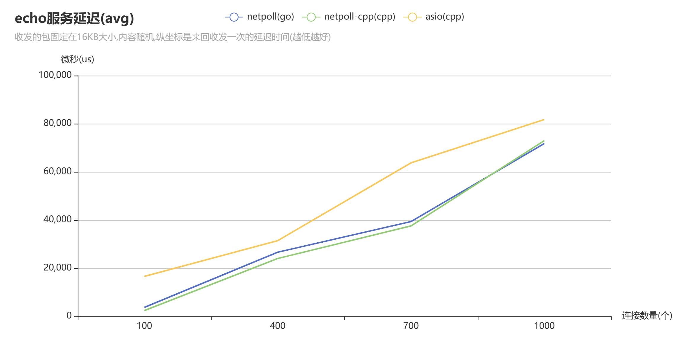
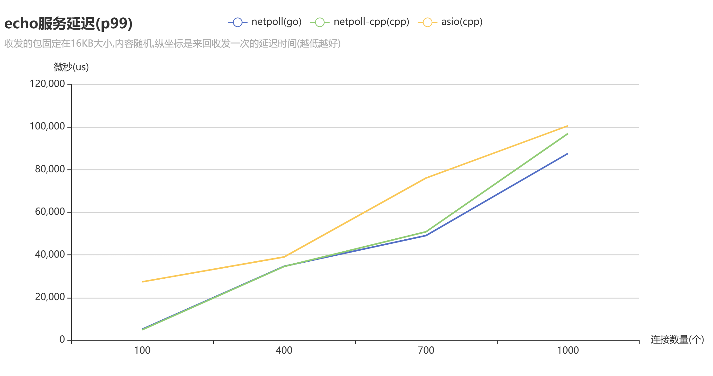

# BenchEcho

这是一个用于测试 tcp echo服务的脚本,可以计算出每个连接进行一次echo服务的延迟,同样也可用该数据计算出吞吐量.

本项目用来测试 [netpoll](https://www.cloudwego.io/zh/docs/netpoll/)/[netpoll-cpp](https://github.com/ACking-you/netpoll-cpp)/[asio](https://www.boost.org/doc/libs/1_82_0/doc/html/boost_asio.html)/[rust-tokio](https://docs.rs/tokio/latest/tokio/)/[rust-monoio](https://docs.rs/monoio/latest/monoio/) 五个网络库的echo服务的性能.

本项目已经进行了最新的测试，但是测试数据还并未更新，测试初步结论：
环境：OS:ubuntu22.04 CPU:R7 7700
- 小数据量的情况下(<4k): avg netpoll-go(10000conn per 84ms)表现最差 rust-tokio(10000 conn per 33ms)表现最好,p99 netpoll-go(10000conn per 124ms)表现最差 rust-tokio(10000conn per 2.2ms)表现最好。此时 netpoll-cpp avg(10000 conn per 57.8ms) p99(10000conn per 63.2ms)
- 稍大数据量情况下(>=4*40k)：avg rust-monoio(10000conn per 2495ms)表现最差 rust-tokio(10000conn per 498ms)表现最好,p99 rust-monoio(10000conn per 2790ms)表现最差 rust-tokio(10000conn per 106ms)表现最好。此时 netpoll-cpp avg(10000conn per 1000ms) p99(10000conn per 1221ms)

经过了连续几十轮10~10000连接1k~1m的发送数据的轮番轰炸，此时查看各个进程的内存的使用情况为：
VIRT: netpoll-go(6330M) >> netpoll-cpp(1618M) > rust-tokio(1158M) > asio(462M) > rust-monoio(71M)
RES: netpoll-cpp(811M) > netpoll-go(524M) > asio(304M) > rust-tokio(101M) > rust-monoio(56M)

上面的语言中go语言是带gc的语言，VIRT占用很大是可以理解的，RES反而占用不是很大，这说明一方面说明go的gc策略对内存释放是比较积极的，另一方面说明netpoll框架的buffer的重用设计的很好。这点在空闲十几分钟后可以得到验证（RES降到155M）

相对而言其他库均在空闲后RES无明显变化，有可能是内存分配器的策略导致的。而在这其中 monoio 的内存 RES 是最优的，这说明该库的buffer内存使用量可能比较少，或者是每次都能动态调整到合适的大小。后面不断尝试新的测试，RES也没有再继续升高，故RES不降低的原因应该是都使用了同样的内存分配器glibc。而具体的RES的差异估计是因为各个框架每次连接使用的buffer策略不同，比如我这个库使用的buffer策略读buffer最低都是8kb。

根据上面对内存使用量的分析也不难推测出不同框架 `avg` 和 `p99` 的结果的产生原因。
在稍大数据量情况下表现最差的 `monoio` 应该就是由于节省了buffer的内存(56M)。
而 `tokio` 在小和大的数据量情况下都表现优异，只能说 `tokio` 真的 nb！
## 运行

测试需要的运行环境如下:

* linux 系统(netpoll-go只支持Linux).
* 请自行编译下载好 asio 库.
* cmake(3.14及以上)和makefile和g++编译器.
* go语言编译器.
* rust语言编译器(需要nightly版本).

想要运行测试只需要执行对应的下列脚本:

* `build.sh` :用于编译用于测试的客户端脚本以及对应的 `netpoll/netpoll-cpp/asio/rust-tokio/rust-monoio` echo服务端.
* `run_bench.sh` :用于测试本地对应端口的echo服务,需要传入四个参数,分别是 `端口/线程数/连接数/随机发送的数据长度/需要测试的内容(avg_p99等)` ,运行脚本有相应的提示.
* `run_server.sh` :用于启动对应的echo服务,需要传入一个参数,这是需要启动的服务,共有 `netpoll-cpp/asio/netpoll-go/rust-tokio/rust-monoio` 这五个服务,分别占用 `7777/8888/9999/11111/22222` 五个端口.
* `run_all_bench.sh`: 用于测试所有的server，请自行先运行好对应的server：`7777/8888/9999/11111/22222`

执行顺序如下:

```shell
./build.sh
./run_server.sh
./run_bench.sh
```

## 测试逻辑

我本机的配置如下:

* R7 4800U(8核16线程,主频1.80GHz)
* 内存16GB
* wsl2-ubuntu22.04LTS

具体测试逻辑如下:

1. 让客户端发送 `16KB` 的随机数据并开始计时.
2. 接收数据发送的 `16KB` 数据,如果一次没有接收完那么就一直到接收到数据完整为止.
3. 接收完毕后,停止计时并打印此次整个过程的耗时,并且把这次的事件加入到总时长(用于算每个连接的平均耗时).
4. 断开连接.

最后得到的测试打印结果会是下面这个样子:

```
#前面会有一大堆的时间打印,表示对应的单个连接echo服务的耗时
all echo sync:
sum:1655333us  #总耗时(将单个连接echo的耗时相加)
average:16553us #平均耗时前面的总耗时/总连接数
p99:23459us #从小到大排序在%99左右的耗时
all echo async:
sum:: 37482 us (37.482000 ms) #整个测试执行的总耗时(因为测试是基于IO多路复用和多线程的)(可用于计算吞吐量)
average:374us #上面的总耗时/总连接数
```


## 测试结果

整个测试的过程基于 `EventLoop` 的 IO 多路复用,一共开了4个 `EventLoop` 同时也对应着四个线程.

模拟了 `100/400/700/1000` 个连接并发的情况,这已经是我本机能够并发的极限,再多的并发客户端就会产生无法处理的错误了.

### avg

下面是平均延迟测试结果.

测试结果的图表如下图所示:



对应的表数据如下:

| 连接数量/网络库 | asio              | netpoll-cpp       | netpoll           |
|:--------:|-------------------|-------------------|-------------------|
|   100    | 16553us(16.53ms)  | 2348us(2.348ms)   | 3674us(3.674ms)   |
|   400    | 31398us(31.398ms) | 23989us(23.989ms) | 26600us(26.600ms) |
|   700    | 63725us(63.725ms) | 37534us(37.534ms) | 39343us(39.343ms) |
|   1000   | 81739us(81.739ms) | 72968us(72.968ms) | 71772us(71.772ms) |

观察上述数据,我们发现 `netpoll` 在连接数多的情况下表现是最好的,同时我们也发现 `asio` 的表现明显不如其他两个库.

这样的表现只是基于 `16KB` 数据的情况,如果数据量下降到 `1KB` 左右,我发现 `asio` 的表现是最好的,而 `netpoll` 表现是最差的.


### p99

下面是p99测试结果:
测试结果的图表如下图所示:



对应的表数据如下:

| 连接数量/网络库 | asio                | netpoll-cpp       | netpoll           |
|:--------:|---------------------|-------------------|-------------------|
|   100    | 27420us(27.420ms)   | 4915us(4.915ms)   | 5196us(5.196ms)   |
|   400    | 39063us(39.063ms)   | 34597us(34.597ms) | 34699us(34.699ms) |
|   700    | 76095us(76.095ms)   | 50875us(50.875ms) | 49105us(49.105ms) |
|   1000   | 100581us(100.581ms) | 96940us(96.940ms) | 87596us(87.596ms) |

